####Predicting Academic Performance Index (API) Score 
####from California Department of Eduaction 
####through Linear Regression


```r
library(car) #cross validation
```

```
## Loading required package: carData
```

```r
library(ggplot2) #ggplot
library(lattice)
library(MASS)
library(dplyr)
```

```
## 
## Attaching package: 'dplyr'
```

```
## The following object is masked from 'package:MASS':
## 
##     select
```

```
## The following object is masked from 'package:car':
## 
##     recode
```

```
## The following objects are masked from 'package:stats':
## 
##     filter, lag
```

```
## The following objects are masked from 'package:base':
## 
##     intersect, setdiff, setequal, union
```

```r
library(caret) #linear
library(leaps) #regsubsets
library(glmnet)
```

```
## Loading required package: Matrix
```

```
## Loading required package: foreach
```

```
## Loaded glmnet 2.0-16
```

```r
library(olsrr)
```

```
## 
## Attaching package: 'olsrr'
```

```
## The following object is masked from 'package:MASS':
## 
##     cement
```

```
## The following object is masked from 'package:datasets':
## 
##     rivers
```

```r
library(e1071)
library(sandwich) 
library(tidyr)
```

```
## 
## Attaching package: 'tidyr'
```

```
## The following object is masked from 'package:Matrix':
## 
##     expand
```

```r
library(purrr) #keep
```

```
## 
## Attaching package: 'purrr'
```

```
## The following objects are masked from 'package:foreach':
## 
##     accumulate, when
```

```
## The following object is masked from 'package:caret':
## 
##     lift
```

```
## The following object is masked from 'package:car':
## 
##     some
```

```r
library(ModelMetrics) #mse
```

```
## 
## Attaching package: 'ModelMetrics'
```

```
## The following object is masked from 'package:glmnet':
## 
##     auc
```

```
## The following objects are masked from 'package:caret':
## 
##     confusionMatrix, precision, recall, sensitivity, specificity
```

```
## The following object is masked from 'package:base':
## 
##     kappa
```

```r
library(corrplot)
```

```
## corrplot 0.84 loaded
```

```r
set.seed(1234)

Base05<- read.csv("/Users/DavidKwon/Desktop/Yongbock/API Score Prj/API 2005 Base Data.csv")
```


####Basic summary of the dataset from the website, California Department of Education
#####"The 2005 API (Academic Performance Index) summarizes a school's, an LEA's (local educational agency, is a school district or county office of education), or the state's performance on the spring 2005 Standardized Testing and Reporting (STAR) Program and 2005 California High School Exit Examination (CAHSEE)."
#####"The 2005 API Base summarizes a subgroup's (e.g STAR Program scores, Ethnic/racial subgroup/ parents' degrees/ English Learners ...) performance on the spring 2005 STAR Program and 2005 CAHSEE. It serves as the baseline score, or starting point, of performance of that subgroup"

#####Therefore, we are going to remove those variables that are created by our dependent variable such as SIM_RANK, ST_RANK
#####I am also going to remove one of the variable, RTYPE or STYPE because they are overlapping each other. 


```r
Base05<-select(Base05,c(-"RTYPE", -"SIM_RANK",-"ST_RANK"))
```

#####Finding NAs rows of the dependent variables and removes the rows that includes NAs


```r
Base05<-Base05[-which(is.na(Base05$API05B)),] 
```

#####Creating function that finds NAs for each variables 


```r
findingNA<-function(x){
  length(which(is.na(x)))/length(x)
}


for(i in 1:dim(Base05)[2]){
  if(findingNA(Base05[,i])>0.1){
    print(i)
  }
}
```

```
## [1] 3
## [1] 4
## [1] 5
## [1] 42
## [1] 46
## [1] 47
## [1] 48
## [1] 66
```


#####I am going to remove the variables that have 10% of the elements is NAs 
#####I also removed the "X" variable (school or district code), which is 1st column


```r
newbase<-Base05[,c(-1, -3, -4, -5, -42, -46, -47, -48, -66)]

new.base<-newbase[complete.cases(newbase),]
```

#####lets explore our dependent variable with ggplot

###Histogram of our dependent variable


```r
ggplot(data=new.base, aes(new.base$API05B)) + 
  geom_histogram(aes(y=..density..), binwidth=10) +
  geom_density(aes(y=..density..), color="red")+
  labs(title="Histogram for Academic Performance Index 2005 Base", x="API 2005 Base", y="Frequency") +
  geom_vline(xintercept = mean(new.base$API05B), show.legend = TRUE, color="red") +
  geom_vline(xintercept = median(new.base$API05B), show.legend = TRUE, color="blue")
```

<!-- -->

#####As the graph shows, we can notice the API05B seems to be left-skewed. 


###Our independent factor variables


```r
new.base[1:97] %>% keep(is.factor) %>% gather() %>%
  ggplot(aes(value))+
  facet_wrap(~key,scales="free")+
  geom_bar()
```

```
## Warning: attributes are not identical across measure variables;
## they will be dropped
```

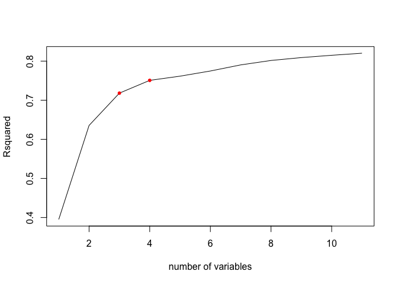<!-- -->


###Our independent numerical variable 

```r
new.base[1:20] %>% keep(is.numeric) %>% gather() %>%
  ggplot(aes(value)) +
  facet_wrap(~key, scales="free")+
  geom_histogram(bins=30)+
  geom_density()
```

<!-- -->

```r
new.base[21:40] %>% keep(is.numeric) %>% gather() %>%
  ggplot(aes(value)) +
  facet_wrap(~key, scales="free")+
  geom_histogram(bins=30)+
  geom_density()
```

<!-- -->

```r
new.base[41:60] %>% keep(is.numeric) %>% gather() %>%
  ggplot(aes(value)) +
  facet_wrap(~key, scales="free")+
  geom_histogram(bins=30)+
  geom_density()
```

<!-- -->

```r
new.base[61:80] %>% keep(is.numeric) %>% gather() %>%
  ggplot(aes(value)) +
  facet_wrap(~key, scales="free")+
  geom_histogram(bins=30)+
  geom_density()
```

<!-- -->

```r
new.base[81:96] %>% keep(is.numeric) %>% gather() %>%
  ggplot(aes(value)) +
  facet_wrap(~key, scales="free")+
  geom_histogram(bins=30)+
  geom_density()
```

<!-- -->

#####Most of our independent numerical variables are highly skewed
#####We might want to perform log tranformation, but I would like to see the model before transformation, and if transformation is needed, I will perform it then. 


###Splitting training and test dataset - cross validation

```r
split<-createDataPartition(y=new.base$API05B,p=0.7,list=FALSE)

training.newbase <- new.base[split,]
test.newbase <- new.base[-split,]
```

####The first model with whole data

```r
lm<-lm(API05B~., data=training.newbase)
summary(lm)
```

```
## 
## Call:
## lm(formula = API05B ~ ., data = training.newbase)
## 
## Residuals:
##     Min      1Q  Median      3Q     Max 
## -369.99  -23.30    0.19   23.70  387.98 
## 
## Coefficients: (15 not defined because of singularities)
##               Estimate Std. Error t value Pr(>|t|)    
## (Intercept)  5.060e+02  7.808e+02   0.648 0.516919    
## STYPE2       1.372e+00  4.938e+00   0.278 0.781090    
## STYPE3       4.516e-01  9.240e+00   0.049 0.961025    
## STYPE4       2.763e-01  2.085e+01   0.013 0.989427    
## STYPEE       1.063e-01  4.738e+00   0.022 0.982096    
## STYPEH       4.048e+00  5.705e+00   0.709 0.478061    
## STYPEM       5.841e+00  5.283e+00   1.106 0.268877    
## VALID_NUM   -7.991e-01  3.561e-01  -2.244 0.024862 *  
## AA_NUM      -3.045e-02  2.121e-02  -1.436 0.151152    
## AA_SIGYes   -3.391e+00  2.288e+00  -1.482 0.138345    
## AI_NUM      -6.781e-02  4.610e-02  -1.471 0.141362    
## AI_SIGYes   -8.093e-01  8.016e+00  -0.101 0.919580    
## AS_NUM      -4.403e-02  2.110e-02  -2.086 0.037018 *  
## AS_SIGYes   -1.582e+00  2.395e+00  -0.661 0.508908    
## FI_NUM      -5.377e-02  2.249e-02  -2.390 0.016861 *  
## FI_SIGYes   -3.005e+00  3.826e+00  -0.785 0.432197    
## HI_NUM      -4.091e-02  2.060e-02  -1.986 0.047085 *  
## HI_SIGYes    2.237e+00  2.104e+00   1.063 0.287824    
## PI_NUM      -4.308e-02  5.160e-02  -0.835 0.403800    
## PI_SIGYes   -1.673e+01  9.627e+00  -1.738 0.082243 .  
## WH_NUM      -4.066e-02  2.077e-02  -1.958 0.050328 .  
## WH_SIGYes    5.455e+00  1.823e+00   2.992 0.002781 ** 
## SD_NUM      -4.120e-03  2.866e-03  -1.437 0.150669    
## SD_SIGYes    1.189e+00  2.205e+00   0.539 0.589895    
## EL_NUM       3.784e-03  3.014e-03   1.256 0.209326    
## EL_SIGYes   -4.284e+00  1.925e+00  -2.225 0.026102 *  
## DI_NUM       7.052e-03  1.066e-02   0.662 0.508224    
## DI_SIGYes    3.047e+00  1.991e+00   1.531 0.125913    
## PCT_AA       4.742e-01  1.864e-01   2.544 0.010969 *  
## PCT_AI       1.370e-01  2.284e-01   0.600 0.548628    
## PCT_AS       2.192e+00  1.919e-01  11.422  < 2e-16 ***
## PCT_FI       1.622e+00  2.558e-01   6.338 2.48e-10 ***
## PCT_HI       1.148e+00  1.771e-01   6.483 9.61e-11 ***
## PCT_PI       5.823e-01  5.605e-01   1.039 0.298873    
## PCT_WH       1.537e+00  1.770e-01   8.684  < 2e-16 ***
## MEALS       -4.013e-01  4.415e-02  -9.088  < 2e-16 ***
## P_FDAY       9.904e-02  5.646e-02   1.754 0.079454 .  
## P_GATE       1.141e+00  8.114e-02  14.062  < 2e-16 ***
## P_MIGED     -4.586e-01  7.743e-02  -5.923 3.32e-09 ***
## P_EL        -6.977e-01  6.889e-02 -10.127  < 2e-16 ***
## P_RFEP       8.360e-01  1.051e-01   7.956 2.08e-15 ***
## P_DI        -1.358e+00  7.909e-02 -17.171  < 2e-16 ***
## SMOB        -1.912e+00  4.606e-01  -4.151 3.35e-05 ***
## CBMOB        3.362e-01  4.649e-01   0.723 0.469513    
## DMOB         2.913e-01  1.026e-01   2.839 0.004536 ** 
## PCT_RESP     2.379e-01  3.037e-02   7.835 5.45e-15 ***
## NOT_HSG     -6.839e-01  1.498e-01  -4.565 5.08e-06 ***
## HSG         -3.870e-01  1.069e-01  -3.621 0.000295 ***
## SOME_COL    -4.914e-01  1.017e-01  -4.831 1.39e-06 ***
## COL_GRAD     1.297e-01  1.294e-01   1.002 0.316350    
## GRAD_SCH     6.633e-01  1.780e-01   3.726 0.000196 ***
## AVG_ED       1.448e+01  6.414e+00   2.258 0.023997 *  
## FULL         2.181e-01  8.914e-02   2.447 0.014438 *  
## EMER         2.709e-02  1.222e-01   0.222 0.824590    
## PEN_2       -2.330e+00  1.519e+00  -1.534 0.125145    
## PEN_35      -1.954e+00  1.520e+00  -1.286 0.198534    
## PEN_6       -2.668e+00  1.521e+00  -1.754 0.079396 .  
## PEN_78      -2.391e+00  1.520e+00  -1.573 0.115757    
## PEN_911     -2.663e+00  1.523e+00  -1.749 0.080374 .  
## ENROLL      -9.971e-02  3.069e-02  -3.249 0.001163 ** 
## PARENT_OPT   2.669e-01  9.873e-02   2.703 0.006887 ** 
## TESTED       1.058e-01  3.254e-02   3.253 0.001149 ** 
## VCST_E28    -3.215e-02  4.189e-01  -0.077 0.938814    
## PCST_E28            NA         NA      NA       NA    
## VCST_E911    4.933e-01  1.563e-01   3.155 0.001613 ** 
## PCST_E911           NA         NA      NA       NA    
## CW_CSTE      8.870e+00  7.804e+00   1.137 0.255732    
## VCST_M28     8.547e-01  2.769e-01   3.086 0.002035 ** 
## PCST_M28            NA         NA      NA       NA    
## VCST_M911    3.650e-01  3.518e-01   1.038 0.299519    
## PCST_M911           NA         NA      NA       NA    
## CW_CSTM     -5.585e+00  7.878e+00  -0.709 0.478347    
## VCST_S28     1.336e-02  2.900e-02   0.461 0.645146    
## PCST_S28            NA         NA      NA       NA    
## VCST_S911   -2.576e-03  9.824e-02  -0.026 0.979085    
## PCST_S911           NA         NA      NA       NA    
## CW_CSTS     -4.500e-01  7.616e+00  -0.059 0.952882    
## VCST_H28    -3.701e-02  1.998e-02  -1.852 0.064057 .  
## PCST_H28            NA         NA      NA       NA    
## VCST_H911   -1.312e-02  2.249e-02  -0.583 0.559677    
## PCST_H911           NA         NA      NA       NA    
## CW_CSTH     -3.998e-01  7.626e+00  -0.052 0.958187    
## VNRT_R28    -4.921e+00  6.898e+00  -0.713 0.475597    
## PNRT_R28            NA         NA      NA       NA    
## CW_NRTR      1.778e+00  1.795e+01   0.099 0.921081    
## VNRT_L28    -1.075e+11  1.158e+11  -0.928 0.353298    
## PNRT_L28     3.585e+12  3.862e+12   0.928 0.353298    
## CW_NRTL      1.201e+02  4.214e+01   2.850 0.004389 ** 
## VNRT_S28     6.399e-01  7.996e-01   0.800 0.423522    
## PNRT_S28            NA         NA      NA       NA    
## CW_NRTS     -1.550e+02  4.179e+01  -3.710 0.000209 ***
## VNRT_M28    -2.361e-01  7.557e-01  -0.312 0.754724    
## PNRT_M28            NA         NA      NA       NA    
## CW_NRTM      9.091e+00  1.605e+01   0.566 0.571121    
## VCHS_E911   -6.596e-02  9.927e-02  -0.664 0.506404    
## PCHS_E911           NA         NA      NA       NA    
## CW_CHSE      2.223e+00  7.674e+00   0.290 0.772121    
## VCHS_M911    5.043e-02  9.471e-02   0.532 0.594406    
## PCHS_M911           NA         NA      NA       NA    
## CW_CHSM      4.562e+00  7.642e+00   0.597 0.550600    
## TOT_28              NA         NA      NA       NA    
## TOT_911             NA         NA      NA       NA    
## ---
## Signif. codes:  0 '***' 0.001 '**' 0.01 '*' 0.05 '.' 0.1 ' ' 1
## 
## Residual standard error: 45.11 on 6582 degrees of freedom
## Multiple R-squared:  0.8452,	Adjusted R-squared:  0.8432 
## F-statistic: 417.9 on 86 and 6582 DF,  p-value: < 2.2e-16
```

```r
plot(lm)
```

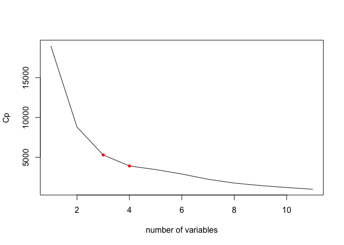<!-- --><!-- --><!-- -->

```
## Warning in sqrt(crit * p * (1 - hh)/hh): NaNs produced

## Warning in sqrt(crit * p * (1 - hh)/hh): NaNs produced
```

<!-- -->

#####There's a lot of NAs of Beta, which implies that it's not estimatable. 
#####We are going to perform variable selection using regsubsets-backward


###regsubsets - model selection - backward - nvmax=10

###Model Selection through stepwise backward selection from regsubsets

#####I let the maximum number of predictors be 10, since it's going to be too complex to interpret or to build a model if we have more than 10 predictors


```r
reg1<-regsubsets(API05B~., data=training.newbase, really.big=TRUE,nvmax=10, method = "backward")
```

```
## Warning in leaps.setup(x, y, wt = wt, nbest = nbest, nvmax = nvmax,
## force.in = force.in, : 16 linear dependencies found
```

```
## Reordering variables and trying again:
```

```r
reg.summary<-summary(reg1)

reg.summary
```

```
## Subset selection object
## Call: regsubsets.formula(API05B ~ ., data = training.newbase, really.big = TRUE, 
##     nvmax = 10, method = "backward")
## 101 Variables  (and intercept)
##            Forced in Forced out
## STYPE2         FALSE      FALSE
## STYPE3         FALSE      FALSE
## STYPE4         FALSE      FALSE
## STYPEE         FALSE      FALSE
## STYPEH         FALSE      FALSE
## STYPEM         FALSE      FALSE
## VALID_NUM      FALSE      FALSE
## AA_NUM         FALSE      FALSE
## AA_SIGYes      FALSE      FALSE
## AI_NUM         FALSE      FALSE
## AI_SIGYes      FALSE      FALSE
## AS_NUM         FALSE      FALSE
## AS_SIGYes      FALSE      FALSE
## FI_NUM         FALSE      FALSE
## FI_SIGYes      FALSE      FALSE
## HI_NUM         FALSE      FALSE
## HI_SIGYes      FALSE      FALSE
## PI_NUM         FALSE      FALSE
## PI_SIGYes      FALSE      FALSE
## WH_NUM         FALSE      FALSE
## WH_SIGYes      FALSE      FALSE
## SD_NUM         FALSE      FALSE
## SD_SIGYes      FALSE      FALSE
## EL_NUM         FALSE      FALSE
## EL_SIGYes      FALSE      FALSE
## DI_NUM         FALSE      FALSE
## DI_SIGYes      FALSE      FALSE
## PCT_AA         FALSE      FALSE
## PCT_AI         FALSE      FALSE
## PCT_AS         FALSE      FALSE
## PCT_FI         FALSE      FALSE
## PCT_HI         FALSE      FALSE
## PCT_PI         FALSE      FALSE
## PCT_WH         FALSE      FALSE
## MEALS          FALSE      FALSE
## P_FDAY         FALSE      FALSE
## P_GATE         FALSE      FALSE
## P_MIGED        FALSE      FALSE
## P_EL           FALSE      FALSE
## P_RFEP         FALSE      FALSE
## P_DI           FALSE      FALSE
## SMOB           FALSE      FALSE
## CBMOB          FALSE      FALSE
## DMOB           FALSE      FALSE
## PCT_RESP       FALSE      FALSE
## NOT_HSG        FALSE      FALSE
## HSG            FALSE      FALSE
## SOME_COL       FALSE      FALSE
## COL_GRAD       FALSE      FALSE
## GRAD_SCH       FALSE      FALSE
## AVG_ED         FALSE      FALSE
## FULL           FALSE      FALSE
## EMER           FALSE      FALSE
## PEN_2          FALSE      FALSE
## PEN_35         FALSE      FALSE
## PEN_6          FALSE      FALSE
## PEN_78         FALSE      FALSE
## PEN_911        FALSE      FALSE
## ENROLL         FALSE      FALSE
## PARENT_OPT     FALSE      FALSE
## TESTED         FALSE      FALSE
## VCST_E28       FALSE      FALSE
## VCST_E911      FALSE      FALSE
## CW_CSTE        FALSE      FALSE
## VCST_M28       FALSE      FALSE
## VCST_M911      FALSE      FALSE
## CW_CSTM        FALSE      FALSE
## VCST_S28       FALSE      FALSE
## VCST_S911      FALSE      FALSE
## CW_CSTS        FALSE      FALSE
## VCST_H28       FALSE      FALSE
## VCST_H911      FALSE      FALSE
## CW_CSTH        FALSE      FALSE
## VNRT_R28       FALSE      FALSE
## CW_NRTR        FALSE      FALSE
## VNRT_L28       FALSE      FALSE
## CW_NRTL        FALSE      FALSE
## VNRT_S28       FALSE      FALSE
## CW_NRTS        FALSE      FALSE
## VNRT_M28       FALSE      FALSE
## CW_NRTM        FALSE      FALSE
## VCHS_E911      FALSE      FALSE
## CW_CHSE        FALSE      FALSE
## VCHS_M911      FALSE      FALSE
## CW_CHSM        FALSE      FALSE
## PCST_E28       FALSE      FALSE
## PCST_E911      FALSE      FALSE
## PCST_M28       FALSE      FALSE
## PCST_M911      FALSE      FALSE
## PCST_S28       FALSE      FALSE
## PCST_S911      FALSE      FALSE
## PCST_H28       FALSE      FALSE
## PCST_H911      FALSE      FALSE
## PNRT_R28       FALSE      FALSE
## PNRT_L28       FALSE      FALSE
## PNRT_S28       FALSE      FALSE
## PNRT_M28       FALSE      FALSE
## PCHS_E911      FALSE      FALSE
## PCHS_M911      FALSE      FALSE
## TOT_28         FALSE      FALSE
## TOT_911        FALSE      FALSE
## 1 subsets of each size up to 11
## Selection Algorithm: backward
##           STYPE2 STYPE3 STYPE4 STYPEE STYPEH STYPEM VALID_NUM AA_NUM
## 1  ( 1 )  " "    " "    " "    " "    " "    " "    " "       " "   
## 2  ( 1 )  " "    " "    " "    " "    " "    " "    " "       " "   
## 3  ( 1 )  " "    " "    " "    " "    " "    " "    " "       " "   
## 4  ( 1 )  " "    " "    " "    " "    " "    " "    " "       " "   
## 5  ( 1 )  " "    " "    " "    " "    " "    " "    " "       " "   
## 6  ( 1 )  " "    " "    " "    " "    " "    " "    " "       " "   
## 7  ( 1 )  " "    " "    " "    " "    " "    " "    " "       " "   
## 8  ( 1 )  " "    " "    " "    " "    " "    " "    " "       " "   
## 9  ( 1 )  " "    " "    " "    " "    " "    " "    " "       " "   
## 10  ( 1 ) " "    " "    " "    " "    " "    " "    " "       " "   
## 11  ( 1 ) " "    " "    " "    " "    " "    " "    " "       " "   
##           AA_SIGYes AI_NUM AI_SIGYes AS_NUM AS_SIGYes FI_NUM FI_SIGYes
## 1  ( 1 )  " "       " "    " "       " "    " "       " "    " "      
## 2  ( 1 )  " "       " "    " "       " "    " "       " "    " "      
## 3  ( 1 )  " "       " "    " "       " "    " "       " "    " "      
## 4  ( 1 )  " "       " "    " "       " "    " "       " "    " "      
## 5  ( 1 )  " "       " "    " "       " "    " "       " "    " "      
## 6  ( 1 )  " "       " "    " "       " "    " "       " "    " "      
## 7  ( 1 )  " "       " "    " "       " "    " "       " "    " "      
## 8  ( 1 )  " "       " "    " "       " "    " "       " "    " "      
## 9  ( 1 )  " "       " "    " "       " "    " "       " "    " "      
## 10  ( 1 ) " "       " "    " "       " "    " "       " "    " "      
## 11  ( 1 ) " "       " "    " "       " "    " "       " "    " "      
##           HI_NUM HI_SIGYes PI_NUM PI_SIGYes WH_NUM WH_SIGYes SD_NUM
## 1  ( 1 )  " "    " "       " "    " "       " "    " "       " "   
## 2  ( 1 )  " "    " "       " "    " "       " "    " "       " "   
## 3  ( 1 )  " "    " "       " "    " "       " "    " "       " "   
## 4  ( 1 )  " "    " "       " "    " "       " "    " "       " "   
## 5  ( 1 )  " "    " "       " "    " "       " "    " "       " "   
## 6  ( 1 )  " "    " "       " "    " "       " "    " "       " "   
## 7  ( 1 )  " "    " "       " "    " "       " "    " "       " "   
## 8  ( 1 )  " "    " "       " "    " "       " "    " "       " "   
## 9  ( 1 )  " "    " "       " "    " "       " "    " "       " "   
## 10  ( 1 ) " "    " "       " "    " "       " "    " "       " "   
## 11  ( 1 ) " "    " "       " "    " "       " "    " "       " "   
##           SD_SIGYes EL_NUM EL_SIGYes DI_NUM DI_SIGYes PCT_AA PCT_AI PCT_AS
## 1  ( 1 )  " "       " "    " "       " "    " "       " "    " "    " "   
## 2  ( 1 )  " "       " "    " "       " "    " "       " "    " "    " "   
## 3  ( 1 )  " "       " "    " "       " "    " "       " "    " "    " "   
## 4  ( 1 )  " "       " "    " "       " "    " "       " "    " "    " "   
## 5  ( 1 )  " "       " "    " "       " "    " "       " "    " "    "*"   
## 6  ( 1 )  " "       " "    " "       " "    " "       " "    " "    "*"   
## 7  ( 1 )  " "       " "    " "       " "    " "       " "    " "    "*"   
## 8  ( 1 )  " "       " "    " "       " "    " "       " "    " "    "*"   
## 9  ( 1 )  " "       " "    " "       " "    " "       " "    " "    "*"   
## 10  ( 1 ) " "       " "    " "       " "    " "       " "    " "    "*"   
## 11  ( 1 ) " "       " "    " "       " "    " "       " "    " "    "*"   
##           PCT_FI PCT_HI PCT_PI PCT_WH MEALS P_FDAY P_GATE P_MIGED P_EL
## 1  ( 1 )  " "    " "    " "    " "    " "   " "    " "    " "     " " 
## 2  ( 1 )  " "    " "    " "    " "    "*"   " "    " "    " "     " " 
## 3  ( 1 )  " "    " "    " "    " "    "*"   " "    " "    " "     " " 
## 4  ( 1 )  " "    " "    " "    " "    "*"   " "    " "    " "     " " 
## 5  ( 1 )  " "    " "    " "    " "    "*"   " "    " "    " "     " " 
## 6  ( 1 )  " "    " "    " "    "*"    "*"   " "    " "    " "     " " 
## 7  ( 1 )  " "    " "    " "    "*"    "*"   " "    " "    " "     " " 
## 8  ( 1 )  " "    " "    " "    "*"    "*"   " "    " "    " "     " " 
## 9  ( 1 )  " "    " "    " "    "*"    "*"   " "    "*"    " "     " " 
## 10  ( 1 ) " "    " "    " "    "*"    "*"   " "    "*"    " "     " " 
## 11  ( 1 ) " "    " "    " "    "*"    "*"   " "    "*"    " "     " " 
##           P_RFEP P_DI SMOB CBMOB DMOB PCT_RESP NOT_HSG HSG SOME_COL
## 1  ( 1 )  " "    " "  "*"  " "   " "  " "      " "     " " " "     
## 2  ( 1 )  " "    " "  "*"  " "   " "  " "      " "     " " " "     
## 3  ( 1 )  " "    " "  "*"  " "   " "  " "      " "     " " " "     
## 4  ( 1 )  " "    " "  "*"  " "   " "  " "      " "     " " " "     
## 5  ( 1 )  " "    " "  "*"  " "   " "  " "      " "     " " " "     
## 6  ( 1 )  " "    " "  "*"  " "   " "  " "      " "     " " " "     
## 7  ( 1 )  " "    "*"  "*"  " "   " "  " "      " "     " " " "     
## 8  ( 1 )  " "    "*"  "*"  " "   " "  " "      " "     " " " "     
## 9  ( 1 )  " "    "*"  "*"  " "   " "  " "      " "     " " " "     
## 10  ( 1 ) " "    "*"  "*"  " "   " "  " "      " "     " " " "     
## 11  ( 1 ) " "    "*"  "*"  " "   " "  " "      "*"     " " " "     
##           COL_GRAD GRAD_SCH AVG_ED FULL EMER PEN_2 PEN_35 PEN_6 PEN_78
## 1  ( 1 )  " "      " "      " "    " "  " "  " "   " "    " "   " "   
## 2  ( 1 )  " "      " "      " "    " "  " "  " "   " "    " "   " "   
## 3  ( 1 )  " "      " "      " "    " "  " "  " "   " "    " "   " "   
## 4  ( 1 )  " "      "*"      " "    " "  " "  " "   " "    " "   " "   
## 5  ( 1 )  " "      "*"      " "    " "  " "  " "   " "    " "   " "   
## 6  ( 1 )  " "      "*"      " "    " "  " "  " "   " "    " "   " "   
## 7  ( 1 )  " "      "*"      " "    " "  " "  " "   " "    " "   " "   
## 8  ( 1 )  " "      "*"      " "    " "  " "  " "   " "    " "   " "   
## 9  ( 1 )  " "      "*"      " "    " "  " "  " "   " "    " "   " "   
## 10  ( 1 ) " "      "*"      " "    " "  " "  " "   " "    "*"   " "   
## 11  ( 1 ) " "      "*"      " "    " "  " "  " "   " "    "*"   " "   
##           PEN_911 ENROLL PARENT_OPT TESTED VCST_E28 PCST_E28 VCST_E911
## 1  ( 1 )  " "     " "    " "        " "    " "      " "      " "      
## 2  ( 1 )  " "     " "    " "        " "    " "      " "      " "      
## 3  ( 1 )  " "     " "    " "        " "    " "      " "      " "      
## 4  ( 1 )  " "     " "    " "        " "    " "      " "      " "      
## 5  ( 1 )  " "     " "    " "        " "    " "      " "      " "      
## 6  ( 1 )  " "     " "    " "        " "    " "      " "      " "      
## 7  ( 1 )  " "     " "    " "        " "    " "      " "      " "      
## 8  ( 1 )  " "     " "    " "        " "    " "      " "      " "      
## 9  ( 1 )  " "     " "    " "        " "    " "      " "      " "      
## 10  ( 1 ) " "     " "    " "        " "    " "      " "      " "      
## 11  ( 1 ) " "     " "    " "        " "    " "      " "      " "      
##           PCST_E911 CW_CSTE VCST_M28 PCST_M28 VCST_M911 PCST_M911 CW_CSTM
## 1  ( 1 )  " "       " "     " "      " "      " "       " "       " "    
## 2  ( 1 )  " "       " "     " "      " "      " "       " "       " "    
## 3  ( 1 )  " "       "*"     " "      " "      " "       " "       " "    
## 4  ( 1 )  " "       "*"     " "      " "      " "       " "       " "    
## 5  ( 1 )  " "       "*"     " "      " "      " "       " "       " "    
## 6  ( 1 )  " "       "*"     " "      " "      " "       " "       " "    
## 7  ( 1 )  " "       "*"     " "      " "      " "       " "       " "    
## 8  ( 1 )  " "       "*"     " "      " "      " "       " "       " "    
## 9  ( 1 )  " "       "*"     " "      " "      " "       " "       " "    
## 10  ( 1 ) " "       "*"     " "      " "      " "       " "       " "    
## 11  ( 1 ) " "       "*"     " "      " "      " "       " "       " "    
##           VCST_S28 PCST_S28 VCST_S911 PCST_S911 CW_CSTS VCST_H28 PCST_H28
## 1  ( 1 )  " "      " "      " "       " "       " "     " "      " "     
## 2  ( 1 )  " "      " "      " "       " "       " "     " "      " "     
## 3  ( 1 )  " "      " "      " "       " "       " "     " "      " "     
## 4  ( 1 )  " "      " "      " "       " "       " "     " "      " "     
## 5  ( 1 )  " "      " "      " "       " "       " "     " "      " "     
## 6  ( 1 )  " "      " "      " "       " "       " "     " "      " "     
## 7  ( 1 )  " "      " "      " "       " "       " "     " "      " "     
## 8  ( 1 )  " "      " "      " "       " "       " "     " "      " "     
## 9  ( 1 )  " "      " "      " "       " "       " "     " "      " "     
## 10  ( 1 ) " "      " "      " "       " "       " "     " "      " "     
## 11  ( 1 ) " "      " "      " "       " "       " "     " "      " "     
##           VCST_H911 PCST_H911 CW_CSTH VNRT_R28 PNRT_R28 CW_NRTR VNRT_L28
## 1  ( 1 )  " "       " "       " "     " "      " "      " "     " "     
## 2  ( 1 )  " "       " "       " "     " "      " "      " "     " "     
## 3  ( 1 )  " "       " "       " "     " "      " "      " "     " "     
## 4  ( 1 )  " "       " "       " "     " "      " "      " "     " "     
## 5  ( 1 )  " "       " "       " "     " "      " "      " "     " "     
## 6  ( 1 )  " "       " "       " "     " "      " "      " "     " "     
## 7  ( 1 )  " "       " "       " "     " "      " "      " "     " "     
## 8  ( 1 )  " "       " "       " "     " "      " "      " "     " "     
## 9  ( 1 )  " "       " "       " "     " "      " "      " "     " "     
## 10  ( 1 ) " "       " "       " "     " "      " "      " "     " "     
## 11  ( 1 ) " "       " "       " "     " "      " "      " "     " "     
##           PNRT_L28 CW_NRTL VNRT_S28 PNRT_S28 CW_NRTS VNRT_M28 PNRT_M28
## 1  ( 1 )  " "      " "     " "      " "      " "     " "      " "     
## 2  ( 1 )  " "      " "     " "      " "      " "     " "      " "     
## 3  ( 1 )  " "      " "     " "      " "      " "     " "      " "     
## 4  ( 1 )  " "      " "     " "      " "      " "     " "      " "     
## 5  ( 1 )  " "      " "     " "      " "      " "     " "      " "     
## 6  ( 1 )  " "      " "     " "      " "      " "     " "      " "     
## 7  ( 1 )  " "      " "     " "      " "      " "     " "      " "     
## 8  ( 1 )  " "      " "     " "      " "      " "     " "      " "     
## 9  ( 1 )  " "      " "     " "      " "      " "     " "      " "     
## 10  ( 1 ) " "      " "     " "      " "      " "     " "      " "     
## 11  ( 1 ) " "      " "     " "      " "      " "     " "      " "     
##           CW_NRTM VCHS_E911 PCHS_E911 CW_CHSE VCHS_M911 PCHS_M911 CW_CHSM
## 1  ( 1 )  " "     " "       " "       " "     " "       " "       " "    
## 2  ( 1 )  " "     " "       " "       " "     " "       " "       " "    
## 3  ( 1 )  " "     " "       " "       " "     " "       " "       " "    
## 4  ( 1 )  " "     " "       " "       " "     " "       " "       " "    
## 5  ( 1 )  " "     " "       " "       " "     " "       " "       " "    
## 6  ( 1 )  " "     " "       " "       " "     " "       " "       " "    
## 7  ( 1 )  " "     " "       " "       " "     " "       " "       " "    
## 8  ( 1 )  " "     " "       " "       " "     " "       " "       "*"    
## 9  ( 1 )  " "     " "       " "       " "     " "       " "       "*"    
## 10  ( 1 ) " "     " "       " "       " "     " "       " "       "*"    
## 11  ( 1 ) " "     " "       " "       " "     " "       " "       "*"    
##           TOT_28 TOT_911
## 1  ( 1 )  " "    " "    
## 2  ( 1 )  " "    " "    
## 3  ( 1 )  " "    " "    
## 4  ( 1 )  " "    " "    
## 5  ( 1 )  " "    " "    
## 6  ( 1 )  " "    " "    
## 7  ( 1 )  " "    " "    
## 8  ( 1 )  " "    " "    
## 9  ( 1 )  " "    " "    
## 10  ( 1 ) " "    " "    
## 11  ( 1 ) " "    " "
```

#####I am going to see the changes of R^2, Adjusted R^2 (how well the model explained), Residuals Sum of Sqaured (Residuals), Cp (size of the bias), BIC 

###R Squared


```r
plot(reg.summary$rsq, xlab="number of variables", ylab="Rsquared", type="l")
max(reg.summary$rsq)
```

```
## [1] 0.8201761
```

```r
which.max(reg.summary$rsq)
```

```
## [1] 11
```

```r
points(3, reg.summary$rsq[3], col="red",cex=1,pch=20)
points(4, reg.summary$rsq[4], col="red",cex=1,pch=20)
```

<!-- -->

#####As the graph shows, we can notice a significant change of R^2 at 3 and 4 of number of variables
#####After that, we see the graph is slightly increasing 
#####I assume that those points are the critical points.  


###Residuals Sum of Squared

```r
plot(reg.summary$rss, xlab="number of variables", ylab="RSS", type="l")
min(reg.summary$rss)
```

```
## [1] 15558564
```

```r
which.min(reg.summary$rss)
```

```
## [1] 11
```

```r
points(3, reg.summary$rss[3], col="red",cex=1,pch=20)
points(4, reg.summary$rss[4], col="red",cex=1,pch=20)
```

<!-- -->

###Adjusted R Squared

```r
plot(reg.summary$adjr2, xlab="number of variables", ylab="Adjusted R^2", type="l")
max(reg.summary$adjr2)
```

```
## [1] 0.8198789
```

```r
which.max(reg.summary$adjr2)
```

```
## [1] 11
```

```r
points(3,reg.summary$adjr2[3],col="red",cex=1,pch=20)
points(4,reg.summary$adjr2[4],col="red",cex=1,pch=20)
```

<!-- -->

###CP
#####From Penn State Univ Stat online Course..
#####(https://onlinecourses.science.psu.edu/stat501/node/330/)

#####"An underspecified model is a model in which important predictors are missing. And, an underspecified model yields biased regression coefficients and biased predictions of the response. Well, in short, Mallows' CP statistic estimates the size of the bias that is introduced into the predicted responses by having an underspecified model."
####In short, CP implies the size of the bias


```r
plot(reg.summary$cp, xlab="number of variables", ylab="Cp", type="l")
min(reg.summary$cp)
```

```
## [1] 982.5362
```

```r
which.min(reg.summary$cp)
```

```
## [1] 11
```

```r
points(3, reg.summary$cp[3],col="red",cex=1,pch=20)
points(4, reg.summary$cp[4],col="red",cex=1,pch=20)
```

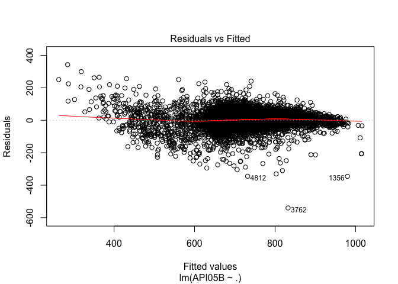<!-- -->


###BIC

```r
plot(reg.summary$bic, xlab="number of variables", ylab="BIC", type="l")
min(reg.summary$bic)
```

```
## [1] -11336.85
```

```r
which.min(reg.summary$bic)
```

```
## [1] 11
```

```r
points(3, reg.summary$bic[3],col="red",cex=1,pch=20)
points(4, reg.summary$bic[4],col="red",cex=1,pch=20)
```

<!-- -->

#####We would try to choose 4 number of predictors for our model from regsubsets. 


```r
a<-c("MEALS", "SMOB","GRAD_SCH","CW_CSTE")

reg.summary$rsq[4]
```

```
## [1] 0.7507709
```

```r
reg.summary$adjr2[4]
```

```
## [1] 0.7506213
```

```r
training.newbase1<-select(training.newbase,c("API05B",a))
rownames(training.newbase1)<-1:nrow(training.newbase1)
```

###Plots between dependent variable and independent variables


```r
plot(training.newbase1)
```

<!-- -->

#####GRAD_SCH with others shows some curves, it looks like log or squared term's graph


```r
training.newbase1 %>% keep(is.numeric) %>% gather() %>%
  ggplot(aes(value)) +
  facet_wrap(~key, scales="free")+
  geom_histogram(bins=30)+
  geom_density()
```

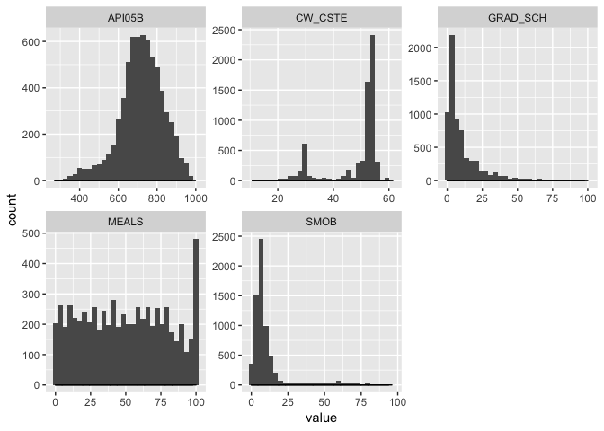<!-- -->


```r
lm1<-lm(API05B~., data=training.newbase1)
summary(lm1)
```

```
## 
## Call:
## lm(formula = API05B ~ ., data = training.newbase1)
## 
## Residuals:
##     Min      1Q  Median      3Q     Max 
## -540.30  -27.88    3.36   31.79  342.30 
## 
## Coefficients:
##              Estimate Std. Error t value Pr(>|t|)    
## (Intercept) 621.06084    4.70077  132.12   <2e-16 ***
## MEALS        -1.52129    0.03151  -48.29   <2e-16 ***
## SMOB         -2.90255    0.05784  -50.18   <2e-16 ***
## GRAD_SCH      2.26144    0.07651   29.56   <2e-16 ***
## CW_CSTE       3.78087    0.08807   42.93   <2e-16 ***
## ---
## Signif. codes:  0 '***' 0.001 '**' 0.01 '*' 0.05 '.' 0.1 ' ' 1
## 
## Residual standard error: 56.88 on 6664 degrees of freedom
## Multiple R-squared:  0.7508,	Adjusted R-squared:  0.7506 
## F-statistic:  5019 on 4 and 6664 DF,  p-value: < 2.2e-16
```

```r
plot(lm1)
```

<!-- -->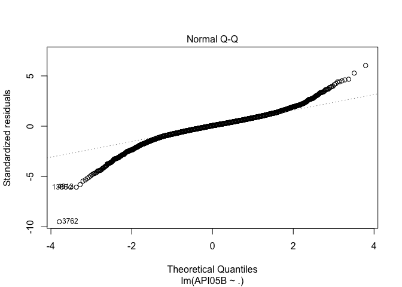<!-- -->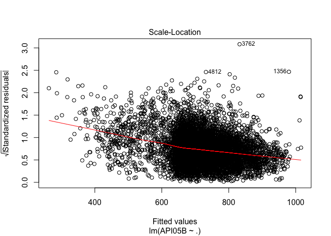<!-- -->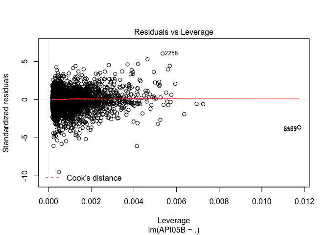<!-- -->

#####Adj R^2 75%, and there looks some patterns and some outliers 


```r
a<-predict(lm1,newdata=test.newbase)
b<-test.newbase$API05B


plot(a,b)
abline(0,1,col="red")
```

<!-- -->

###Predicted values vs test values of API05B
####The graph looks like linear, and some outliers


```r
predictions1 <- lm1 %>% predict(test.newbase)
```

###Model performance


```r
data.frame(
  MSE = mse(test.newbase$API05B, predictions1),
  RMSE = RMSE(predictions1, test.newbase$API05B),
  R2 = R2(predictions1, test.newbase$API05B)
)
```

```
##        MSE     RMSE        R2
## 1 3097.677 55.65678 0.7599359
```


###1. Outliers

####Finding outliers in our model

####There are several ways to see outliers in our model

```r
outlierTest(lm1,n.max=50,cutoff=0.05)
```

```
##       rstudent unadjusted p-value Bonferonni p
## 3762 -9.564767         1.5455e-21   1.0307e-17
## 1356 -6.105577         1.0819e-09   7.2152e-06
## 4812 -6.078444         1.2806e-09   8.5402e-06
## 2258  6.049796         1.5289e-09   1.0196e-05
## 3944 -5.831300         5.7572e-09   3.8395e-05
## 3364 -5.468623         4.7001e-08   3.1345e-04
## 743  -5.353180         8.9307e-08   5.9559e-04
## 2410  5.286745         1.2847e-07   8.5676e-04
## 2700 -5.187371         2.1958e-07   1.4644e-03
## 1452 -5.084014         3.7962e-07   2.5317e-03
## 1573 -4.945453         7.7827e-07   5.1903e-03
## 4680 -4.837192         1.3464e-06   8.9795e-03
## 4743 -4.756764         2.0086e-06   1.3396e-02
## 2314 -4.695724         2.7098e-06   1.8072e-02
## 488  -4.675050         2.9967e-06   1.9985e-02
## 2646  4.674809         3.0002e-06   2.0008e-02
## 5849 -4.635340         3.6314e-06   2.4218e-02
## 1118  4.612801         4.0470e-06   2.6990e-02
## 2054  4.512308         6.5227e-06   4.3500e-02
## 2143 -4.484455         7.4326e-06   4.9568e-02
```

#####outlierTest shows which observations have greater than absolute value of 4 of rstudent. 


```r
qqPlot(lm1,main="QQ Plot")
```

<!-- -->

```
## [1] 1356 3762
```

#####qqPlot shows which observations have an impact on normality of residuals - which is outliers or bad leverage points


```r
influencePlot(lm1,id.method="identify",main="influential plot",sub="circle size is proportial to cook's distance")
```

```
## Warning in plot.window(...): "id.method" is not a graphical parameter
```

```
## Warning in plot.xy(xy, type, ...): "id.method" is not a graphical parameter
```

```
## Warning in axis(side = side, at = at, labels = labels, ...): "id.method" is
## not a graphical parameter

## Warning in axis(side = side, at = at, labels = labels, ...): "id.method" is
## not a graphical parameter
```

```
## Warning in box(...): "id.method" is not a graphical parameter
```

```
## Warning in title(...): "id.method" is not a graphical parameter
```

```
## Warning in plot.xy(xy.coords(x, y), type = type, ...): "id.method" is not a
## graphical parameter
```

<!-- -->

```
##        StudRes          Hat       CookD
## 1356 -6.105577 0.0041423445 0.030844268
## 2158 -3.624570 0.0117503290 0.031184299
## 2258  6.049796 0.0053462040 0.039135526
## 3762 -9.564767 0.0004855073 0.008768559
## 5582 -3.671075 0.0117526656 0.031994464
```

#####Hat Values against Studentized Residuals

#\

####However,
####I'm using Standardized Residuals to detect outliers

####From Springers Text book "Linear Regression", Chapter 3.2 - Regression Diagnostics: Tools for Checking the Validity of a Model, pg 60. 

#####"In summary, an outlier is a point whose standardized residual falls outside the interval from -2 to 2. Recall that a bad leverage point is a leverage point which is also an outlier. Thus, a bad leverage point is a leverage point whose standardized residual falls outside the interval from -2 to 2."
####In very large datasets, we apply the rule to -4 to 4. 
#\

```r
o1<-which(rstandard(lm1, infl = lm.influence(lm1, do.coef = FALSE),
                    sd=sqrt(deviance(lm1)/df.residual(lm1)),
                    type=c("sd.1","predictive"))>4)

o2<-which(rstandard(lm1, infl = lm.influence(lm1, do.coef = FALSE),
                    sd=sqrt(deviance(lm1)/df.residual(lm1)),
                    type=c("sd.1","predictive"))<(-4))


outliers <- c(o1,o2)
length(outliers)
```

```
## [1] 36
```

####The data set after removing outliers


```r
training.newbase2<-training.newbase1[-outliers,]
```

####Investigating linear models between response and each predictors - partial regression
##### API05B = B0 + B1*MEALS + E

```r
lm.test1<-lm(API05B~MEALS, data=training.newbase2)
summary(lm.test1)
```

```
## 
## Call:
## lm(formula = API05B ~ MEALS, data = training.newbase2)
## 
## Residuals:
##     Min      1Q  Median      3Q     Max 
## -459.85  -32.83   18.05   58.69  260.33 
## 
## Coefficients:
##              Estimate Std. Error t value Pr(>|t|)    
## (Intercept) 821.21233    2.23874  366.82   <2e-16 ***
## MEALS        -2.02565    0.03833  -52.84   <2e-16 ***
## ---
## Signif. codes:  0 '***' 0.001 '**' 0.01 '*' 0.05 '.' 0.1 ' ' 1
## 
## Residual standard error: 94.34 on 6631 degrees of freedom
## Multiple R-squared:  0.2963,	Adjusted R-squared:  0.2962 
## F-statistic:  2792 on 1 and 6631 DF,  p-value: < 2.2e-16
```

```r
plot(lm.test1)
```

<!-- --><!-- -->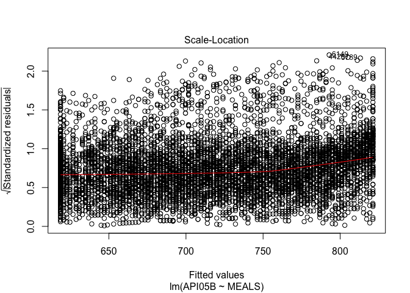<!-- --><!-- -->

#####Adj R^2 29.6%, plots looks ok except for normal Q-Q plot

##### API05B = B0 + B1*SMOB + E

```r
lm.test2<-lm(API05B~SMOB, data=training.newbase2)
summary(lm.test2)
```

```
## 
## Call:
## lm(formula = API05B ~ SMOB, data = training.newbase2)
## 
## Residuals:
##     Min      1Q  Median      3Q     Max 
## -323.53  -59.63   -2.25   60.70  351.42 
## 
## Coefficients:
##              Estimate Std. Error t value Pr(>|t|)    
## (Intercept) 774.11173    1.33456  580.05   <2e-16 ***
## SMOB         -4.95317    0.07364  -67.26   <2e-16 ***
## ---
## Signif. codes:  0 '***' 0.001 '**' 0.01 '*' 0.05 '.' 0.1 ' ' 1
## 
## Residual standard error: 86.71 on 6631 degrees of freedom
## Multiple R-squared:  0.4056,	Adjusted R-squared:  0.4055 
## F-statistic:  4524 on 1 and 6631 DF,  p-value: < 2.2e-16
```

```r
plot(lm.test2)
```

<!-- -->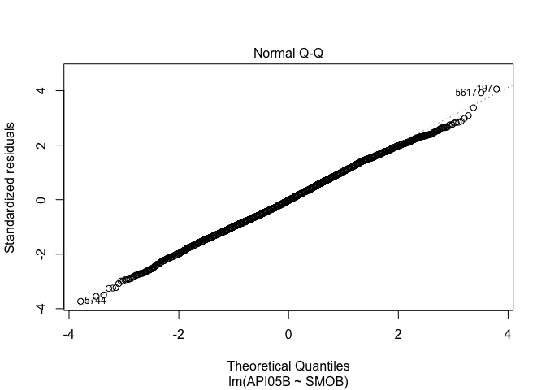<!-- -->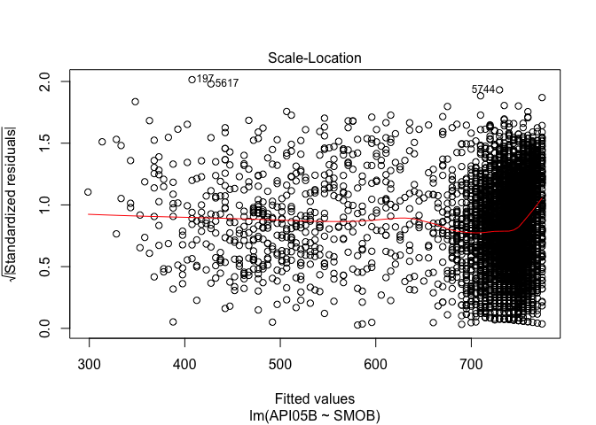<!-- --><!-- -->

#####Adj R^2 40%, seems heteroscedasticity

##### API05B = B0 + B1*GRAD_SCH + E

```r
lm.test3<-lm(API05B~GRAD_SCH, data=training.newbase2)
summary(lm.test3)
```

```
## 
## Call:
## lm(formula = API05B ~ GRAD_SCH, data = training.newbase2)
## 
## Residuals:
##     Min      1Q  Median      3Q     Max 
## -423.04  -38.67   10.97   56.64  288.02 
## 
## Coefficients:
##              Estimate Std. Error t value Pr(>|t|)    
## (Intercept) 660.58650    1.40222  471.10   <2e-16 ***
## GRAD_SCH      5.69449    0.08647   65.86   <2e-16 ***
## ---
## Signif. codes:  0 '***' 0.001 '**' 0.01 '*' 0.05 '.' 0.1 ' ' 1
## 
## Residual standard error: 87.44 on 6631 degrees of freedom
## Multiple R-squared:  0.3954,	Adjusted R-squared:  0.3953 
## F-statistic:  4337 on 1 and 6631 DF,  p-value: < 2.2e-16
```

```r
plot(lm.test3)
```

<!-- -->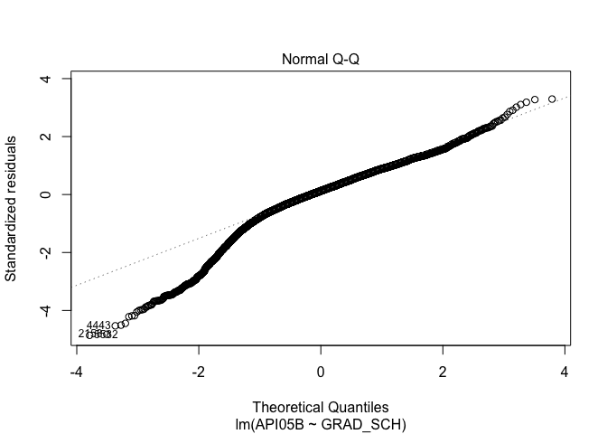<!-- -->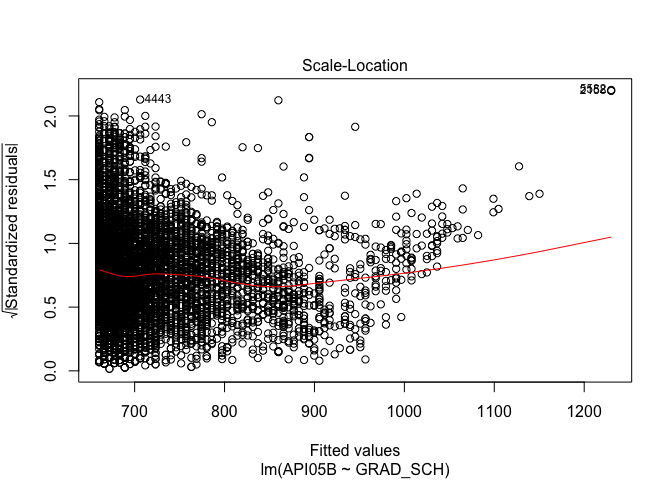<!-- -->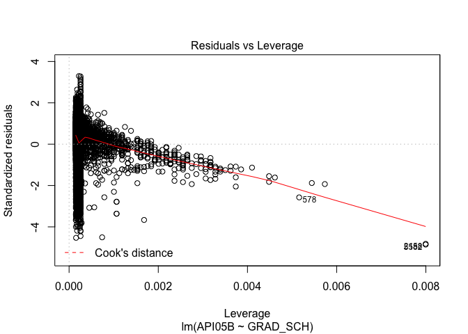<!-- -->

#####R^2 39.5%, plots shows extreme heteroscedasticity

##### API05B = B0 + B1*CW_CSTE + E

```r
lm.test4<-lm(API05B~CW_CSTE, data=training.newbase2)
summary(lm.test4)
```

```
## 
## Call:
## lm(formula = API05B ~ CW_CSTE, data = training.newbase2)
## 
## Residuals:
##     Min      1Q  Median      3Q     Max 
## -411.25  -69.79    0.66   70.67  326.49 
## 
## Coefficients:
##             Estimate Std. Error t value Pr(>|t|)    
## (Intercept) 456.9592     6.2326   73.32   <2e-16 ***
## CW_CSTE       5.4549     0.1268   43.03   <2e-16 ***
## ---
## Signif. codes:  0 '***' 0.001 '**' 0.01 '*' 0.05 '.' 0.1 ' ' 1
## 
## Residual standard error: 99.43 on 6631 degrees of freedom
## Multiple R-squared:  0.2183,	Adjusted R-squared:  0.2182 
## F-statistic:  1852 on 1 and 6631 DF,  p-value: < 2.2e-16
```

```r
plot(lm.test4)
```

<!-- -->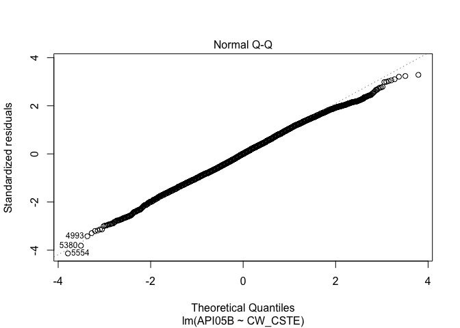<!-- -->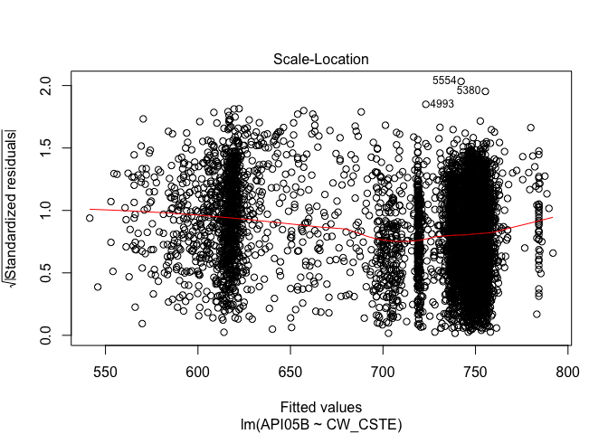<!-- --><!-- -->

#####R^2 21.8%, plots shows some patterns showing heteroscedasticity

###Model after removing outliers

```r
lm2<-lm(API05B~., data=training.newbase2)
summary(lm2)
```

```
## 
## Call:
## lm(formula = API05B ~ ., data = training.newbase2)
## 
## Residuals:
##      Min       1Q   Median       3Q      Max 
## -225.373  -28.309    2.242   30.659  230.408 
## 
## Coefficients:
##              Estimate Std. Error t value Pr(>|t|)    
## (Intercept) 623.13764    4.40548  141.45   <2e-16 ***
## MEALS        -1.56062    0.02955  -52.81   <2e-16 ***
## SMOB         -2.95763    0.05448  -54.29   <2e-16 ***
## GRAD_SCH      2.21507    0.07178   30.86   <2e-16 ***
## CW_CSTE       3.81710    0.08252   46.26   <2e-16 ***
## ---
## Signif. codes:  0 '***' 0.001 '**' 0.01 '*' 0.05 '.' 0.1 ' ' 1
## 
## Residual standard error: 53.11 on 6628 degrees of freedom
## Multiple R-squared:  0.777,	Adjusted R-squared:  0.7769 
## F-statistic:  5775 on 4 and 6628 DF,  p-value: < 2.2e-16
```

```r
plot(lm2)
```

<!-- --><!-- --><!-- --><!-- -->

####Adj R^2 77%, plots looks ok except for showing some pattern of the heteroscedasticity. 

####R^2 getting higher, plots for model such as 'fitted values vs residuals', 'Normal Q-Q', or 'sqrt of Standardized residuals vs fitted values' becomes much better after removing outliers

####It's still showing some patterns, I will perform diagnosis of normality of residuals, multicollinearity, and heteroscedasticity from now. 


```r
a1<-predict(lm2,newdata = test.newbase)

predictions2 <- lm2 %>% predict(test.newbase)
```

### Model performance

```r
data.frame(
  MSE = mse(test.newbase$API05B, predictions2),
  RMSE = RMSE(predictions2, test.newbase$API05B),
  R2 = R2(predictions2, test.newbase$API05B)
)
```

```
##        MSE     RMSE        R2
## 1 3097.117 55.65174 0.7598707
```


###2. Normality (of residuals)

#####We don't have to worry about the assumption of normality of residuals (the error between the dependent variable and the independent variables) because when the sample size is sufficiently large, the Central Limit Theorem ensures that the distribution of residiual will be approximately normality. 


```r
qplot(residuals(lm2),
      geom="histogram",
      binwidth= 10,
      main="Histogram of Residuals of our model",
      xlab="Residuals of our model",
      ylab="Frequency")
```

<!-- -->

```r
mean(residuals(lm2))
```

```
## [1] -8.158894e-16
```

####Residuals on our model are approximately normal distributed with zero mean. 


###3. Multicolliniearity

#####From STHDA website.. 

####definition

#####"In multiple regression , two or more predictor variables might be correlated with each other. This situation is referred as collinearity.

#####There is an extreme situation, called multicollinearity, where collinearity exists between three or more variables even if no pair of variables has a particularly high correlation. This means that there is redundancy between predictor variables."


```r
cor<-cor(training.newbase2)
corrplot(cor, 
         method=c("circle"),
         title="Correlation between variables",
         type=c("full"))
```

<!-- -->

```r
vif(lm2)
```

```
##    MEALS     SMOB GRAD_SCH  CW_CSTE 
## 1.874570 1.458532 1.867840 1.485354
```

####More than 4 VIF score must be removed, but we dont have any.

###4. Heteroscedasciticity (non-constant residuals)


```r
plot(lm2)
```

<!-- --><!-- --><!-- --><!-- -->

#####As we see the first plot of the model (fitted value vs residuals), 
#####the residuals plots show decreasing variance towards the right end.
#####It seems like there's heteroscedasticity exists, so I'm going to perform transformation. 

###Box-cox


```r
bc<-boxcox(lm2)
```

<!-- -->

#####Finding maximum log-likelihoods for the parameter of the Box-Cox power trasnformation, which is lambda


```r
lambda<-bc$x[which.max(bc$y)]
lambda
```

```
## [1] 2
```

###Boxcox power + log transformation


```r
lm3<-lm(API05B^(lambda)~MEALS+log(SMOB+1)+log(GRAD_SCH+1)+CW_CSTE, data=training.newbase2)
summary(lm3)
```

```
## 
## Call:
## lm(formula = API05B^(lambda) ~ MEALS + log(SMOB + 1) + log(GRAD_SCH + 
##     1) + CW_CSTE, data = training.newbase2)
## 
## Residuals:
##     Min      1Q  Median      3Q     Max 
## -327955  -44794     605   46969  327029 
## 
## Coefficients:
##                    Estimate Std. Error t value Pr(>|t|)    
## (Intercept)       398321.29    7812.70   50.98   <2e-16 ***
## MEALS              -2127.65      44.86  -47.42   <2e-16 ***
## log(SMOB + 1)     -61332.05    1362.81  -45.00   <2e-16 ***
## log(GRAD_SCH + 1)  35881.42    1350.71   26.57   <2e-16 ***
## CW_CSTE             6170.79     109.67   56.27   <2e-16 ***
## ---
## Signif. codes:  0 '***' 0.001 '**' 0.01 '*' 0.05 '.' 0.1 ' ' 1
## 
## Residual standard error: 75390 on 6628 degrees of freedom
## Multiple R-squared:  0.7682,	Adjusted R-squared:  0.7681 
## F-statistic:  5491 on 4 and 6628 DF,  p-value: < 2.2e-16
```

```r
plot(lm3)
```

<!-- --><!-- --><!-- --><!-- -->

####Adj R^2 76.8%. 
####The residuals plots look improved, which is that it looks like now it's homoscedasticity (constant residuals, no patterns)


```r
a2<-sqrt(predict(lm3,newdata = test.newbase))
```

###Model Progress by showing graphs of "predicted vs test values"


```r
plot(a,b,
     main="First model prediction",
     xlab="predicted values",
     ylab="values in test dataset")
abline(a=0,b=1,col="red")
```

<!-- -->

```r
plot(a1,b,
     main="Removed outliers",
     xlab="predicted values",
     ylab="values in test dataset")
abline(a=0,b=1,col="red")
```

<!-- -->

```r
plot(a2,b,
     main="After transformation - Final model",
     xlab="predicted values",
     ylab="values in test dataset")
abline(a=0,b=1,col="red")
```

<!-- -->

####The graphs with final model seems to be linear, and there is no patters. 


```r
predictions3 <- lm3 %>% predict(test.newbase)
```

### Model performance

```r
data.frame(
  MSE = mse(test.newbase$API05B, predictions3),
  RMSE = RMSE(predictions3, test.newbase$API05B),
  R2 = R2(predictions3, test.newbase$API05B)
)
```

```
##            MSE     RMSE        R2
## 1 298721055021 546553.8 0.7477782
```

###Model performance changing process


```r
c.m<-data.frame(MSE=
                  c(mse(test.newbase$API05B, predictions1),
                    mse(test.newbase$API05B, predictions2),
                    mse(test.newbase$API05B, predictions3)
                  ),
                RMSE=
                  c(RMSE(predictions1,test.newbase$API05B),
                    RMSE(predictions2,test.newbase$API05B),
                    RMSE(predictions3,test.newbase$API05B)
                  ),
                R2=
                  c(R2(predictions1,test.newbase$API05B),
                    R2(predictions2,test.newbase$API05B),
                    R2(predictions3,test.newbase$API05B)
                  ))


rownames(c.m)<-c("First model","Removed Outliers","After transformation-final model")

c.m
```

```
##                                           MSE         RMSE        R2
## First model                      3.097677e+03     55.65678 0.7599359
## Removed Outliers                 3.097117e+03     55.65174 0.7598707
## After transformation-final model 2.987211e+11 546553.79884 0.7477782
```


```r
summary(lm3)
```

```
## 
## Call:
## lm(formula = API05B^(lambda) ~ MEALS + log(SMOB + 1) + log(GRAD_SCH + 
##     1) + CW_CSTE, data = training.newbase2)
## 
## Residuals:
##     Min      1Q  Median      3Q     Max 
## -327955  -44794     605   46969  327029 
## 
## Coefficients:
##                    Estimate Std. Error t value Pr(>|t|)    
## (Intercept)       398321.29    7812.70   50.98   <2e-16 ***
## MEALS              -2127.65      44.86  -47.42   <2e-16 ***
## log(SMOB + 1)     -61332.05    1362.81  -45.00   <2e-16 ***
## log(GRAD_SCH + 1)  35881.42    1350.71   26.57   <2e-16 ***
## CW_CSTE             6170.79     109.67   56.27   <2e-16 ***
## ---
## Signif. codes:  0 '***' 0.001 '**' 0.01 '*' 0.05 '.' 0.1 ' ' 1
## 
## Residual standard error: 75390 on 6628 degrees of freedom
## Multiple R-squared:  0.7682,	Adjusted R-squared:  0.7681 
## F-statistic:  5491 on 4 and 6628 DF,  p-value: < 2.2e-16
```

###Conclusion
  
####I conclude that we are able to predict the API score for the future with the 3 of predictors, which are described at below, as 76.8% variance explained with all transformed predictors have less than 0.05 p-values, which is that they are all significant predictors on our response variable. 
  
####As interpretation of the Betas (each coefficients),    
  
#####For example,  
  
   
   
####- For a 1 units increase in MEALS, 

$\mid(Beta1)\mid$ = 2127.65 decrease in $(API05B)^2$ score 
  


####- For a 1% increase in SMOB, 

$\mid Beta2\mid$ $\times$ ${\log(1.01+1))}$ = 61332.05 $\times$ ${\log(1.01+1))}$ = 42818.66 
  

#####     Therefore, 

$\mid Beta2\mid$ $\times$ ${\log(1.01+1))}$ = 61332.05 $\times$ ${\log(1.01+1))}$ = 42818.66 decrease in squared API05B score  
  
#####     In other words, 1 percent change in SMOB is associated with 

$\mid Beta2\mid$ $\times$ ${\log(1.01+1))}$ change in $API05B^(lambda)$ = $(API05B)^2$, where lambda is 2  
  


####- For a 10% increase in GRAD_SCH,  

Beta3 $\times$ ${\log (1.1+1)}$ = 35881.42 $\times$ ${\log (1.1+1)}$ = 26621.77  

#####     API score is transformed with lambda, which is power to the 2, from box-cox transformation, 

#####     Therefore, 

Beta3 $\times$ ${\log(1.1+1))}$ = 35881.42 $\times$ ${\log (1.1+1)}$ = 26621.77 increase in squared API05B score

#####     In other words, 1 percent change in GRAD_SCH is associated with 

Beta3 $\times$ ${\log(1.1+1))}$ change in $API05B^(lambda)$ = $(API05B)^2$, where lambda is 2


####- For a 10 units increase in CW_CSTE, 

Beta4 $\times$ 10 = 6170.79 $\times$ 10 = 61707.9 increase in sqaured API05B score
